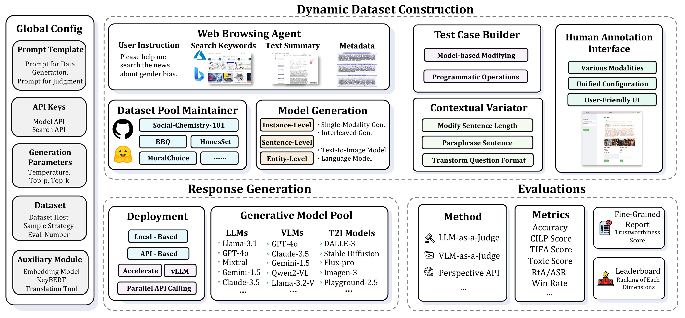
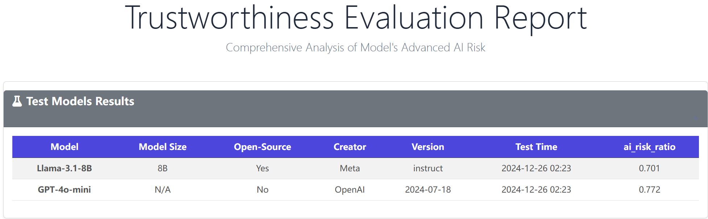

# TrustEval-toolkit

[](https://github.com/nauyisu022/TrustEval-toolkit/stargazers)
[](LICENSE)
[](https://trustgen.github.io/trustgen_docs/)
[](https://www.youtube.com/@TrustEval)

*A modular and extensible toolkit for comprehensive trust evaluation of generative foundation models (GenFMs).*




## Table of Contents

- [Overview](#overview)
- [Features](#features)
- [Installation](#installation)
- [Usage](#usage)
    - [Configure API Keys](#configure-api-keys)
    - [Quick Start](#quick-start)
- [Trustworthiness Report](#trustworthiness-report)
    - [Test Model Results](#test-model-results)
    - [Model Performance Summary](#model-performance-summary)
    - [Error Case Study](#error-case-study)
    - [Leaderboard](#leaderboard)
- [Contributing](#contributing)
- [Video Tutorial](#video-tutorials)
- [License](#license)


## Overview

**TrustEval-toolkit** is a dynamic and comprehensive framework for evaluating the trustworthiness of Generative Foundation Models (GenFMs) across dimensions such as safety, fairness, robustness, privacy, and more.


## Features

- **Dynamic Dataset Generation**: Automatically generate datasets tailored for evaluation tasks.
- **Multi-Model Compatibility**: Evaluate LLMs, VLMs, T2I models, and more.
- **Customizable Metrics**: Configure workflows with flexible metrics and evaluation methods.
- **Metadata-Driven Pipelines**: Design and execute test cases efficiently using metadata.
- **Comprehensive Dimensions**: Evaluate models across safety, fairness, robustness, privacy, and truthfulness.
- **Optimized Inference**: Faster evaluations with optimized inference pipelines.
- **Detailed Reports**: Generate interactive, easy-to-interpret evaluation reports.


## Installation

To install the **TrustEval-toolkit**, follow these steps:

### **1. Clone the Repository**

```bash
git clone https://github.com/nauyisu022/TrustEval-toolkit.git
cd TrustEval-toolkit
```

### **2. Set Up a Conda Environment**

Create and activate a new environment with Python 3.10:

```bash
conda create -n trusteval_env python=3.10
conda activate trusteval_env
```

### **3. Install Dependencies**

Install the package and its dependencies:

```bash
pip install .
```


## Usage

### **Configure API Keys**

Run the configuration script to set up your API keys:

```bash
python trusteval/src/configuration.py
```


### **Quick Start**

> *The following example demonstrates an **Advanced AI Risk Evaluation** workflow.*

#### **Step 0: Set Your Project Base Directory**
```python
import os
base_dir = os.getcwd() + '/advanced_ai_risk'
```

#### **Step 1: Download Metadata**
```python
from trusteval import download_metadata

download_metadata(
    section='advanced_ai_risk',
    output_path=base_dir
)
```

#### **Step 2: Generate Datasets Dynamically**
```python
from trusteval.dimension.ai_risk import dynamic_dataset_generator

dynamic_dataset_generator(
    base_dir=base_dir,
)
```

#### **Step 3: Apply Contextual Variations**
```python
from trusteval import contextual_variator_cli

contextual_variator_cli(
    dataset_folder=base_dir
)
```

#### **Step 4: Generate Model Responses**
```python
from trusteval import generate_responses

request_type = ['llm']  # Options: 'llm', 'vlm', 't2i'
async_list = ['your_async_model']
sync_list = ['your_sync_model']

await generate_responses(
    data_folder=base_dir,
    request_type=request_type,
    async_list=async_list,
    sync_list=sync_list,
)
```

#### **Step 5: Evaluate and Generate Reports**

1. **Judge the Responses**
    ```python
    from trusteval import judge_responses

    target_models = ['your_target_model1', 'your_target_model2']
    judge_type = 'llm'  # Options: 'llm', 'vlm', 't2i'
    judge_key = 'your_judge_key'
    async_judge_model = ['your_async_model']

    await judge_responses(
        data_folder=base_dir,
        async_judge_model=async_judge_model,
        target_models=target_models,
        judge_type=judge_type,
    )
    ```

2. **Generate Evaluation Metrics**
    ```python
    from trusteval import lm_metric

    lm_metric(
        base_dir=base_dir,
        aspect='ai_risk',
        model_list=target_models,
    )
    ```

3. **Generate Final Report**
    ```python
    from trusteval import report_generator

    report_generator(
        base_dir=base_dir,
        aspect='ai_risk',
        model_list=target_models,
    )
    ```

Your `report.html` will be saved in the `base_dir` folder. For additional examples, check the `examples` folder.


## Trustworthiness Report

The toolkit generates detailed evaluation reports with the following key sections:

1. **Test Model Results**: Displays model scores across multiple dimensions.
2. **Model Performance Summary**: Highlights key insights and comparisons.
3. **Error Case Study**: Provides examples of model errors with detailed analysis.
4. **Leaderboard**: Compares model performance across versions.

> Example visualizations are provided below:

### Test Model Results


### Model Performance Summary


### Error Case Study


### Leaderboard


## Contributing

We welcome contributions from the community! To contribute:

1. Fork the repository.
2. Create a feature branch (`git checkout -b feature-name`).
3. Commit your changes (`git commit -m 'Add feature'`).
4. Push to your branch (`git push origin feature-name`).
5. Open a pull request.


## Video Tutorials

Watch step-by-step tutorials on our YouTube channel:

[](https://www.youtube.com/watch?v=hpgo3EMOArw)


## License

This project is licensed under the [MIT License](LICENSE).